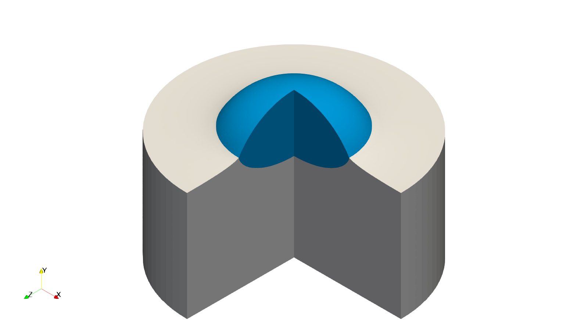

This code/repository supplements the mathematical results of the paper 

## **SHARP-INTERFACE LIMITS OF CAHN–HILLIARD MODELS AND MECHANICS WITH MOVING CONTACT LINES**

by Leonie Schmeller and Dirk Peschka from the [Weierstrass Institute for Applied Analysis and Stochastics](https://www.wias-berlin.de) in Berlin published in the SIAM Journal *Multiscale Modeling and Simulation (MMS)*
in 2024 with the DOI [https://doi.org/10.1137/23M1546592](https://doi.org/10.1137/23M1546592).

**Abstract.** We construct gradient structures for free boundary problems with nonlinear elasticity and study the impact of moving contact lines. In this context, we numerically analyze how phase-field models converge to certain sharp-interface limits when the interface thickness tends to zero $\varepsilon\to 0$. In particular, we study the scaling of the Cahn-Hilliard mobility $m(\varepsilon)=m_0\varepsilon^\alpha$ for $0\le \alpha \le \infty$. In the presence of interfaces, it is known that the intended sharp-interface limit is only valid for $\underline{\alpha}<\alpha<\overline{\alpha}$.  However, in the presence of moving contact lines we show that $\alpha$ near $\underline{\alpha}$ produces significant errors.

**Funding:** We acknowledge the funding by the German Research Foundation (DFG) within the DFG Priority Program SPP 2171 *Dynamic Wetting of Flexible, Adaptive, and Switchable Substrates* through the projects 422786086 and 422792530 and thank the [Berlin Mathematics Research Center MATH+](https://mathplus.de) for funding and support through project AA2-9.

In the image below we show the central setup studied in this paper: A droplet relaxes from an initial state at t=0 to a relaxed state at t=1.15. The droplet (blue) is liquid with and the substrate (gray) is a neo-Hookean solid. During the evolution the sum of elastic and surface/interfacial energy decreases. The solution shown uses sharp interfaces.

